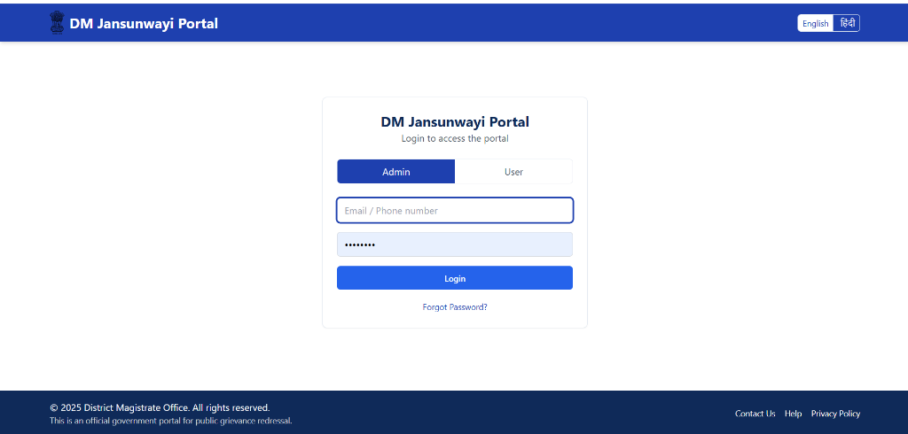
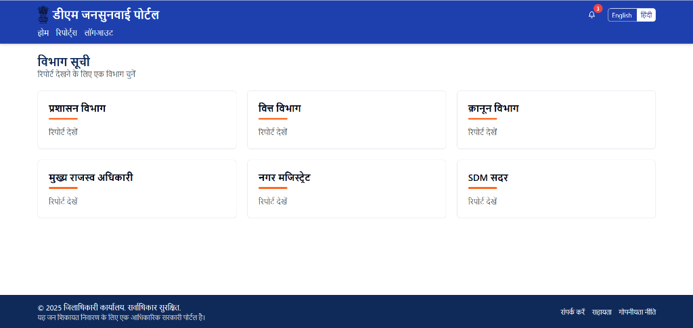
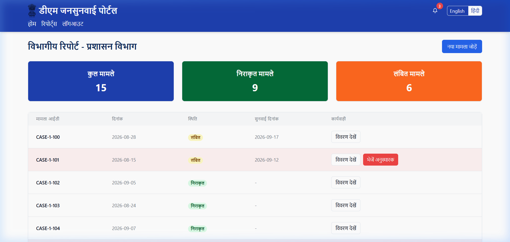
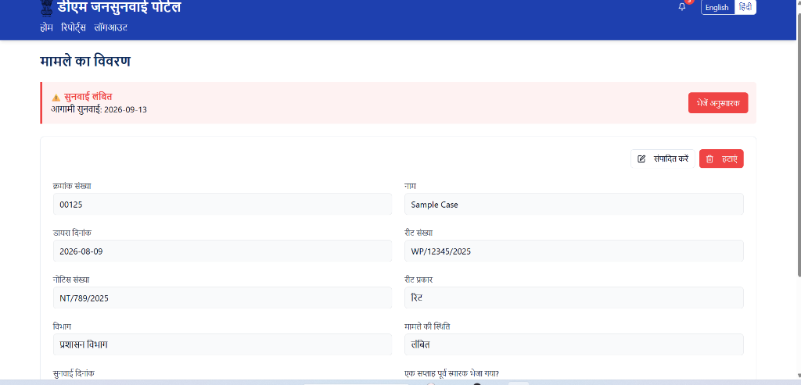

# 🏛️ DM Jansunwayi Portal

<div align="center">

### ⚖️ Official Public Grievance Redressal & Hearing Monitoring System ⚖️

*Empowering citizens and district administration with transparent grievance redressal, department-wise tracking, and automated hearing reminders.*

[](https://github.com/KeyToCoding/jansunwayi-portal-app/issues)
[](https://github.com/KeyToCoding/jansunwayi-portal-app/network)
[](https://github.com/KeyToCoding/jansunwayi-portal-app/stargazers)
[](https://opensource.org/licenses/MIT)

[🐛 Report Bug](https://github.com/KeyToCoding/jansunwayi-portal-app/issues) · [✨ Request Feature](https://github.com/KeyToCoding/jansunwayi-portal-app/issues)

<br/>



</div>

---

## 🌟 Overview

**DM Jansunwayi Portal** is a modern, responsive web application designed for District Magistrate administrations and citizens to streamline the public grievance redressal process (*जनसुनवाई*). Built with modern web technologies, the portal enables transparent complaint registration, case tracking, department assignment, and hearing date management.

### Why Choose DM Jansunwayi Portal?

- 🏛️ **Administrative Efficiency:** Centralized hub for District Magistrates and officers to monitor grievances across all district departments.
- 🗣️ **Bilingual Accessibility:** Instant one-click toggle between **Hindi (हिंदी)** and **English** for seamless citizen communication.
- 🔔 **Hearing & Alert Tracking:** Real-time visibility into upcoming hearing dates (*आगामी सुनवाई*), pending notices, and reminders.
- 🛡️ **Role-Based Access Control:** Dedicated administrative workflows and citizen views with tailored permissions.

---

## ✨ Key Features

### 🏛️ Administrative Governance
- **Department Allocation:** Manage complaints across departments including General Administration (*प्रशासन विभाग*), Finance (*वित्त विभाग*), Legal (*क़ानून विभाग*), Chief Revenue Officer (*मुख्य राजस्व अधिकारी*), City Magistrate (*नगर मजिस्ट्रेट*), and SDM Sadar (*SDM सदर*).
- **Hearing Reminders & Escalations:** Automatic flags for cases with pending hearings or overdue responses.
- **Action Controls:** Update case status, edit case entries, or discharge resolved complaints directly from the portal.

### 👥 Citizen & Public Services
- **Case Tracking:** Look up grievance history by serial number, writ number (*रीट संख्या*), or notice number (*नोटिस संख्या*).
- **Status Transparency:** Clear tracking badges indicating whether a matter is Pending (*लंबित*), In Hearing, or Resolved.
- **Multi-Identifier Login:** Support for both email and registered mobile numbers for quick access.

### 🌐 Modern UI & Accessibility
- **Indian Government Theme:** Designed with official tri-color accents and government insignia styling.
- **Fully Responsive:** Smooth layout transitions across mobile phones, tablets, and desktop workstations.
- **Instant Search & Filtering:** Filter cases by department, date range, writ type, or urgency level.

---

## 📸 Screenshots & Visual Tour

### 1. Login & Authentication (*लॉग इन*)
Secure role-based authentication supporting both administrative officers and citizens with bilingual interface switching.


---

### 2. Department Directory (*विभाग सूची*)
Interactive administrative dashboard organizing grievances department-wise for quick drill-down reports.



---

### 3. Department Grievance Report (*विभागीय रिपोर्ट*)
Comprehensive grievance reports with detailed metrics, status summaries, and case lists.



---

### 4. Case & Hearing Details (*मामले का विवरण*)
In-depth case sheet with hearing countdowns, writ identifiers, notice history, and status change controls.



---

## 🔐 Demo Credentials

The portal comes pre-configured with default credentials for demonstration and testing:

| Role | Selection Toggle | Email / Mobile | Password | Access Level |
| :--- | :--- | :--- | :--- | :--- |
| **Admin** | `Admin` | `admin@dm.gov.in` *or* `9999999999` | `admin123` | Full administrative, hearing, and department control |
| **Citizen / User** | `User` | `user@dm.gov.in` *or* `8888888888` | `user123` | Grievance submission and status tracking |

---

## 🛠️ Built With

- **[React 18](https://react.dev/)** - Modern component-based frontend library
- **[TypeScript](https://www.typescriptlang.org/)** - Strict type safety and robust developer experience
- **[Vite](https://vitejs.dev/)** - Next-generation frontend tooling and rapid bundling
- **[Tailwind CSS](https://tailwindcss.com/)** - Utility-first styling with custom government theme tokens
- **[shadcn/ui](https://ui.shadcn.com/) & [Radix UI](https://www.radix-ui.com/)** - Accessible, high-quality component primitives
- **[Lucide React](https://lucide.dev/)** - Clean, consistent iconography
- **[TanStack Query](https://tanstack.com/query)** - Data fetching, caching, and state synchronization

---

## 🚀 Getting Started

### Prerequisites

Ensure you have the following installed on your machine:
- **Node.js** (v18.0.0 or higher recommended)
- **npm** or **bun** / **yarn**
- **Git**

### Installation

1. **Clone the repository:**
   ```bash
   git clone https://github.com/KeyToCoding/jansunwayi-portal-app.git
   ```

2. **Navigate to the project directory:**
   ```bash
   cd jansunwayi-portal-app
   ```

3. **Install dependencies:**
   ```bash
   npm install
   ```

4. **Start the local development server:**
   ```bash
   npm run dev
   ```

5. **Open in your browser:**
   ```
   http://localhost:5173/
   ```

---

## 📂 Project Structure

```text
jansunwayi-portal-app/
├── public/                # Static assets, favicon, and robots.txt
├── screenshots/           # Application screenshots for documentation
│   ├── 01-login-page.png
│   ├── 02-departments-dashboard.png
│   ├── 03-case-details.png
│   └── 04-department-report.png
├── src/
│   ├── components/        # Reusable UI & layout components
│   │   ├── ui/            # shadcn/ui component library
│   │   └── Layout.tsx     # Main navbar, language toggle & footer
│   ├── contexts/          # AppContext for language, auth & role state
│   ├── pages/             # Application views
│   │   ├── LoginPage.tsx      # Multi-role authentication page
│   │   ├── DashboardPage.tsx  # Department directory & overview
│   │   ├── DepartmentPage.tsx # Department case analytics & tables
│   │   ├── AddCasePage.tsx    # Grievance registration form
│   │   ├── CaseDetailPage.tsx # Detailed case & hearing monitor
│   │   └── NotFound.tsx       # 404 handler
│   ├── App.tsx            # Main application routing
│   └── main.tsx           # Entry point
├── package.json           # Dependencies and scripts
├── tailwind.config.ts     # Styling design system
└── vite.config.ts         # Vite build configuration
```

---

## 🤝 Contributing

Contributions are what make the open-source community an inspiring place to learn, build, and innovate. Any contributions you make are **greatly appreciated**.

1. Fork the Project
2. Create your Feature Branch (`git checkout -b feature/AmazingFeature`)
3. Commit your Changes (`git commit -m 'feat: Add AmazingFeature'`)
4. Push to the Branch (`git push origin feature/AmazingFeature`)
5. Open a Pull Request

---

## 👨‍💻 Developer

**Kartikey Vishwakarma**  
*Full Stack Developer*  
- 🌐 LinkedIn: [kartikey28](https://www.linkedin.com/in/kartikey28/)  
- 🐙 GitHub: [@KeyToCoding](https://github.com/KeyToCoding)  

---

## 📜 License

Distributed under the **MIT License**. See `LICENSE` for more information.

<div align="center">

### 🙏 सत्यमेव जयते 🙏
*District Magistrate Jan Sunwayi & Grievance Monitoring Platform*

Made with ❤️ by [Kartikey Vishwakarma](https://www.linkedin.com/in/kartikey28/)

</div>
